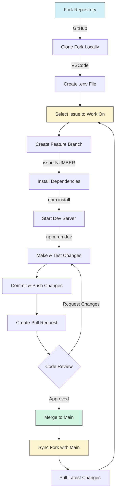

# AGiXT Interactive Development Workflow Guide

To contribute to AGiXT Interactive, follow this guide to set up your development environment and workflow.

## Initial Setup

1. **Fork the Repository**
   - Go to <https://github.com/AGiXT/interactive>
   - Click the "Fork" button to create your personal copy

2. **Clone Your Fork Locally**
   - Open VSCode
   - Clone your fork: `git clone <URL of your fork>`
   - Navigate to your repository folder

3. **Configure Environment**
   - Create a `.env` file in the root folder with:

4. **Choose your AGiXT Server and Agent**
   - Set the `AGIXT_SERVER` to your AGiXT server if you're running one, or a remote AGiXT server by URL
   - Set the `AGIXT_AGENT` to the default agent to use

```bash
AGIXT_SERVER=http://localhost:7437
AGIXT_AGENT=XT
```

## Development Cycle

1. **Select an Issue**
   - Browse open issues at <https://github.com/AGiXT/interactive/issues>
   - Choose an issue to work on

2. **Create a Feature Branch**
   - In VSCode, from the Source Control tab
   - Click on "main" to open the branch menu
   - Select "+ Create new branch..."
   - Name it `issue-<ISSUE_NUMBER>` (e.g., `issue-42`)

3. **Set Up Development Environment**
   - Install dependencies: `npm install`
   - Start development server: `npm run dev`
   - Access the app at <http://localhost:3437>

4. **Implement & Test Your Changes**
   - Make necessary code changes
   - Test thoroughly on your local environment

5. **Submit Your Work**
   - Commit your changes with descriptive messages
   - Push your branch to your fork
   - Create a Pull Request against the main repository

6. **Review Process**
   - A team member will review your PR
   - Address any requested changes
   - Once approved, your changes will be merged and bounty will be issued if applicable.

7. **Sync Your Fork**
   - After the PR is merged, go to your fork on GitHub
   - Click "Sync fork" to update with the main repository
   - In VSCode, switch back to main branch: `git checkout main`
   - Pull the latest changes: `git pull`

8. **Start Next Task**
   - Begin a new cycle with another issue


